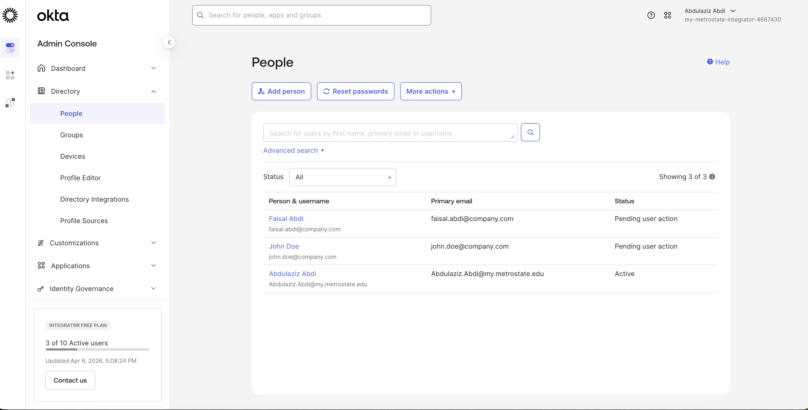
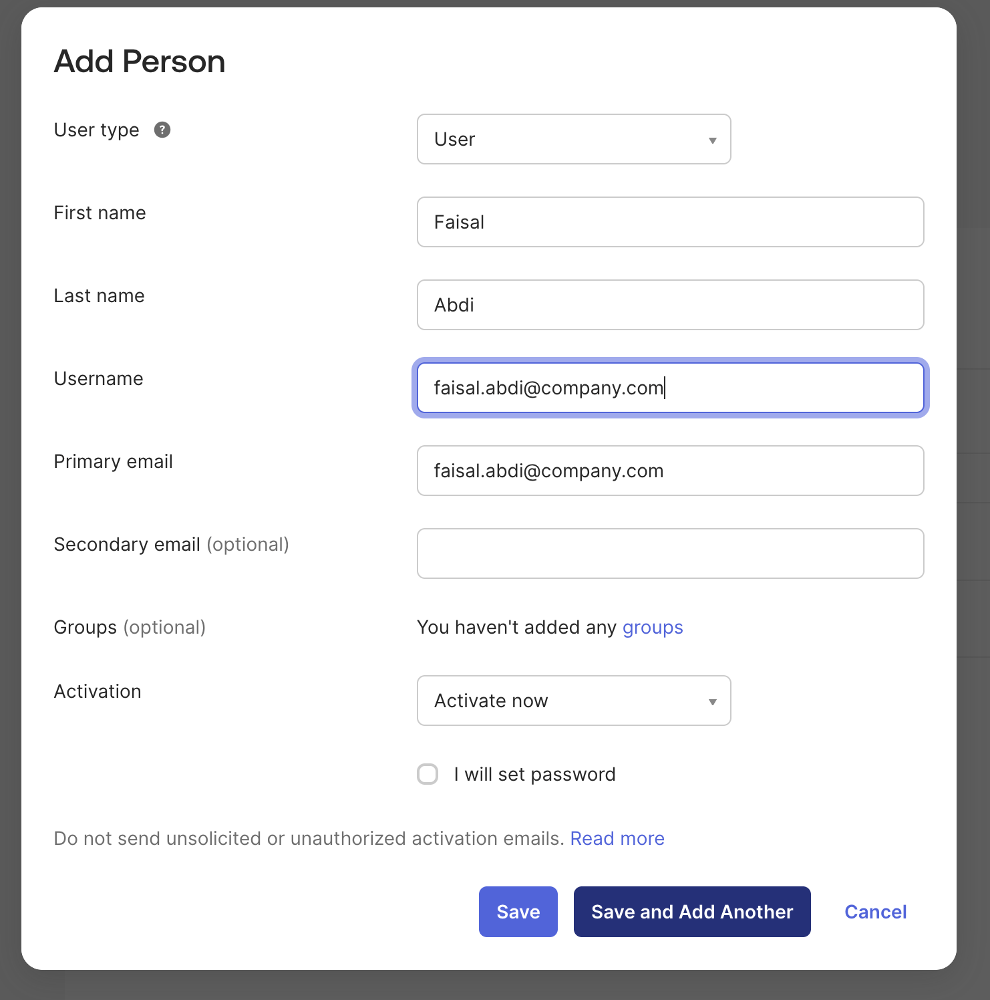
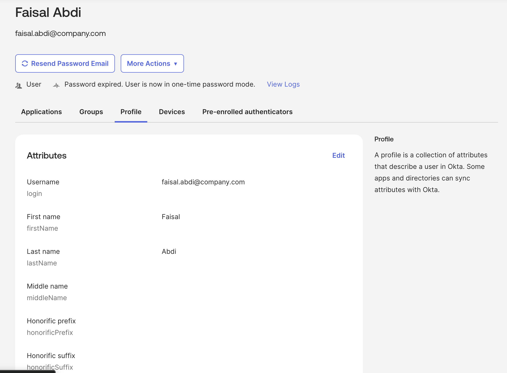
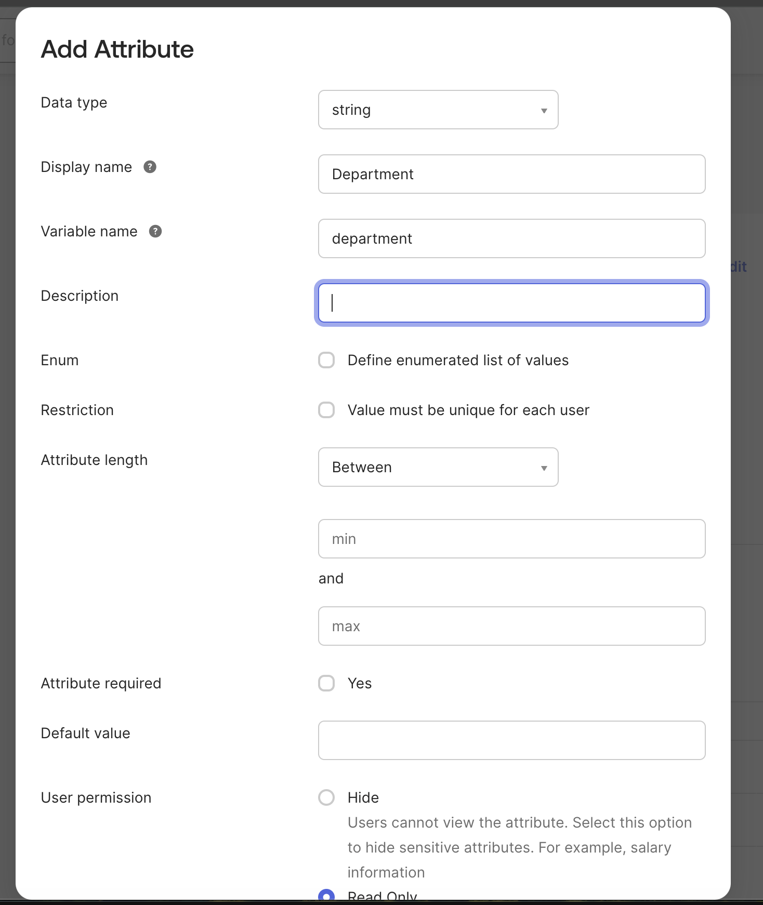
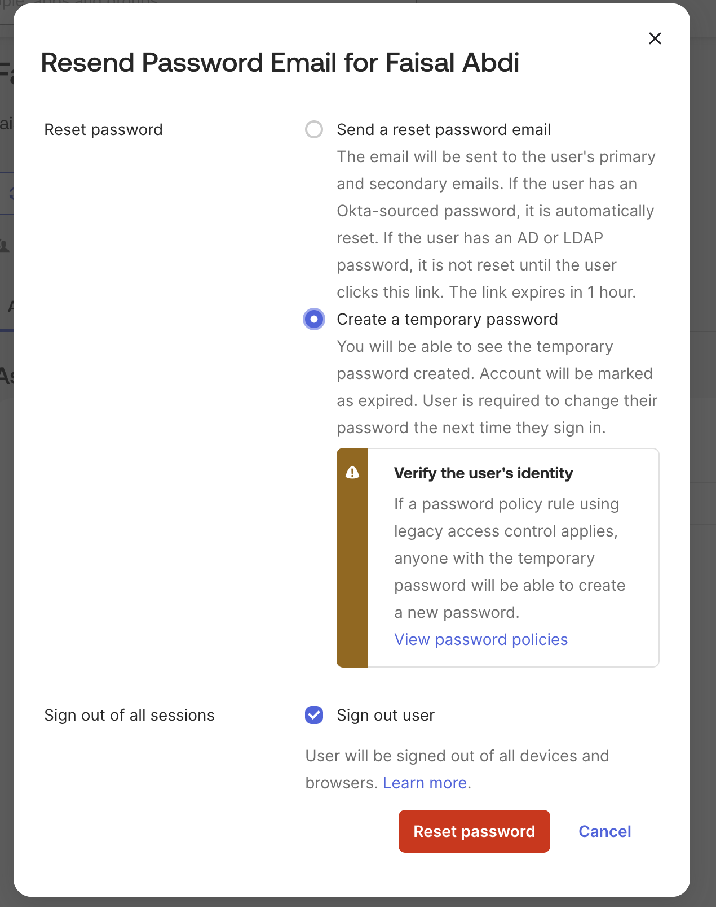
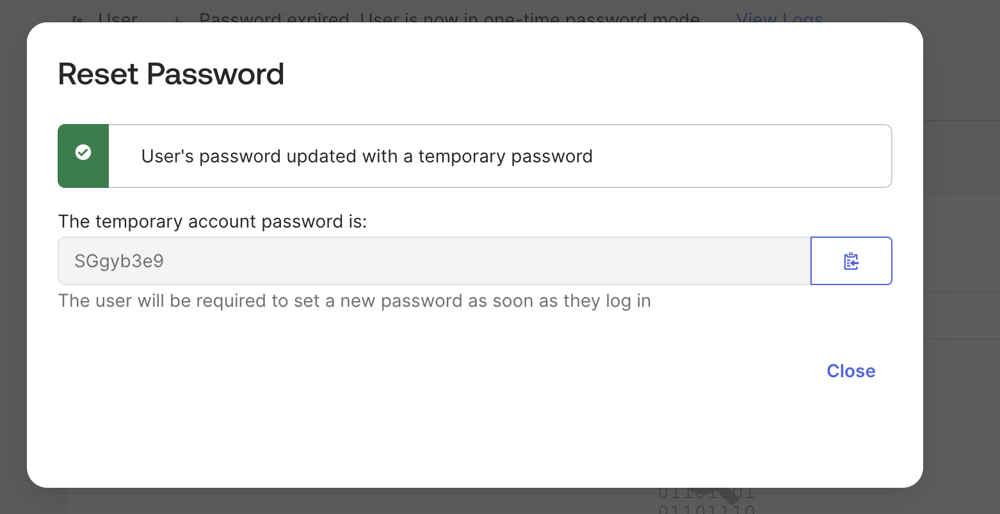
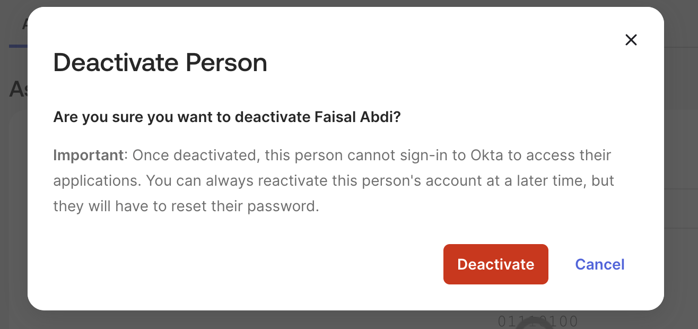
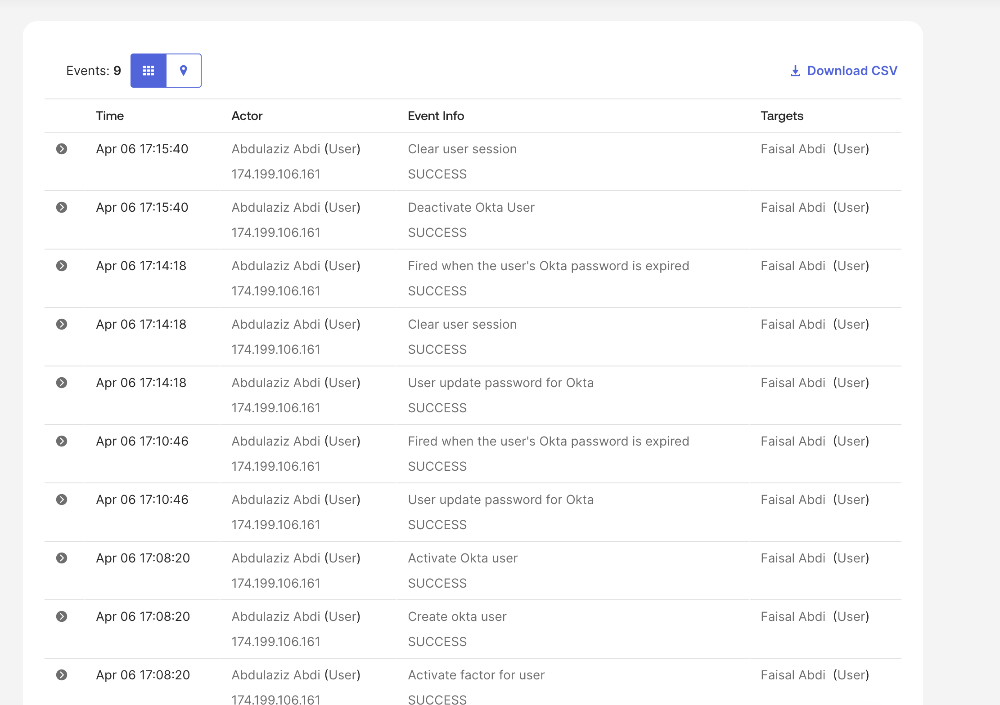

# Lab 1 — Okta User Lifecycle & Profile Management

## Objective
Create and manage user accounts in Okta to simulate identity lifecycle processes including user creation, password reset, deactivation, and audit logging.

This lab establishes the foundation for Okta IAM and identity management labs.

---

## What is User Lifecycle Management?
User Lifecycle Management is the process of managing user identities from creation to deactivation. This includes:
- User onboarding (account creation)
- Credential management (password resets)
- User updates and maintenance
- User offboarding (account deactivation)
- Identity activity monitoring

---

## Lab Steps

### Step 1 — Navigate to Users
Go to:  
Directory → People  

Screenshot:  

---

### Step 2 — Create New User
Click:  
Add Person  

Configure:
- First Name: Faisal  
- Last Name: Abdi  
- Username: faisal.abdi@company.com  
- Primary Email: faisal.abdi@company.com  

Click:  
Save  

Screenshot:  

---

### Step 3 — Verify User in Directory
Confirm the user appears in the People dashboard.

Screenshot:  

---

### Step 4 — Review User Profile
Open the user profile and verify attributes.

Screenshot:  

---

## Step 5 — Add Custom Attribute (Hire Date)
Go to:  
Directory → Profile Editor → Okta User (Profile) → Add Attribute  

Configure:
- Data type: string  
- Display name: Faisal Abdi  
- Variable name: faisalabdi
- Attribute length: 10 characters  
- Attribute required: No  
- User permission: Read Only  

Screenshot:  

---

### Step 6 — Reset User Password
Click:  
Resend Password Email  

Select:
Create a temporary password  

Ensure:
Sign out user is checked  

Click:
Reset password  

Screenshot:  

---

### Step 7 — Temporary Password Generated
Verify temporary password is generated and user must change it at next login.

Screenshot:  

---

### Step 8 — Deactivate User
Click:  
More Actions → Deactivate  

Confirm deactivation.

Screenshot:  

---

### Step 9 — Monitor System Logs
Go to:  
Reports → System Log  

Verify events:
- Create user  
- Password reset  
- Deactivate user  

Screenshot:  

---

## Result
User lifecycle operations completed:
- User created  
- Custom attribute configured  
- Password reset performed  
- User deactivated  
- Events verified in logs  

---

## Skills Demonstrated
- User lifecycle management  
- Custom attribute configuration  
- Credential management  
- User deactivation  
- Identity monitoring (logs)  
- Okta Admin Console usage  

---

## Next Lab
Group-Based Access Control (RBAC) using Okta Groups
