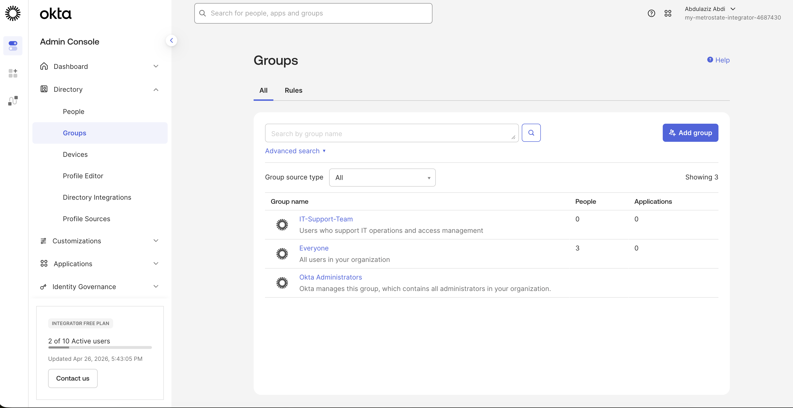
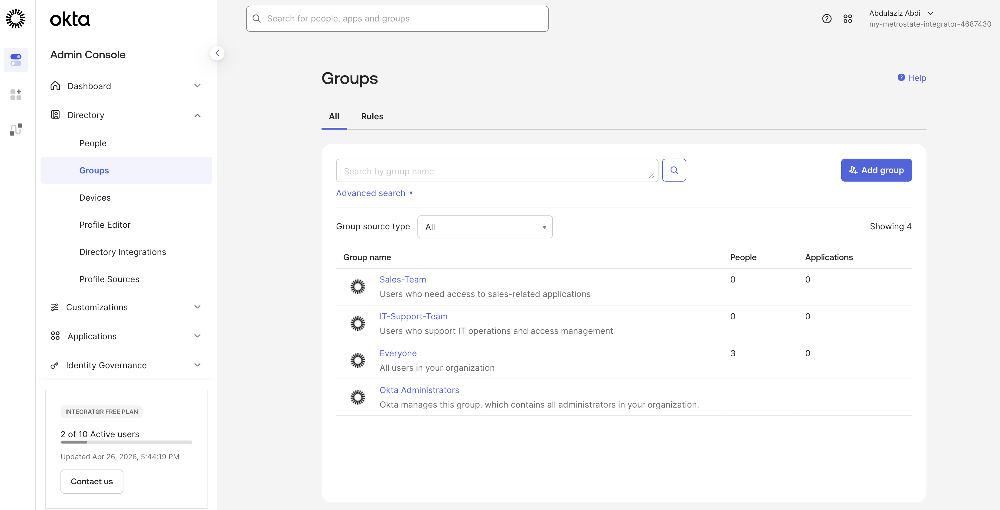
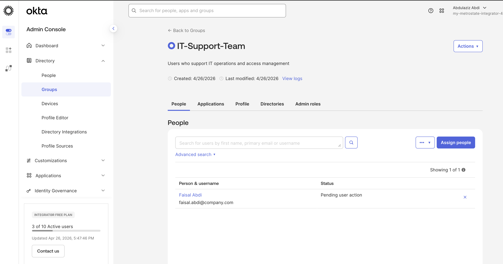
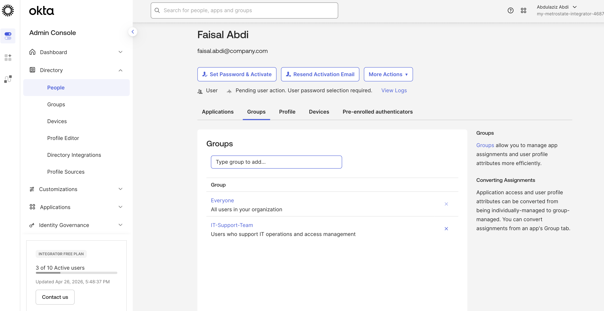
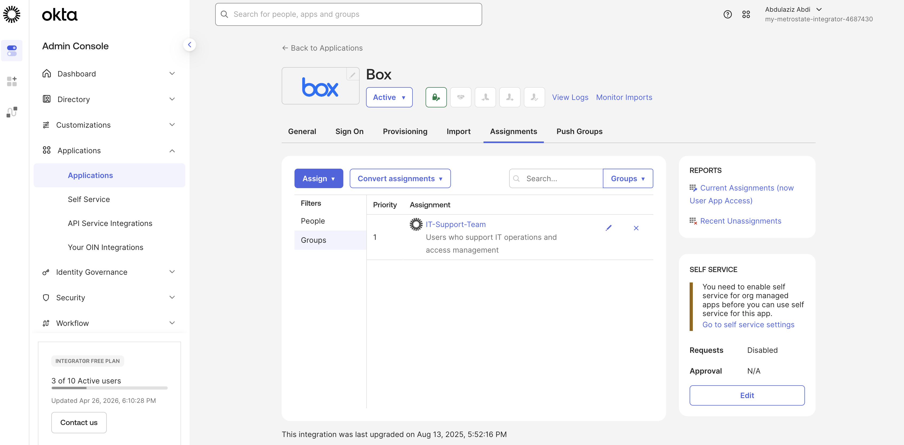

### Step 1 — Create Groups

Go to:
Directory → Groups

Create:
- IT-Support-Team
- Sales-Team

Screenshot:

---

### Step 2 — View Groups List

Verify groups appear in directory.

Screenshot:

---

### Step 3 — Add User to Group

Open:
IT-Support-Team

Click:
Assign people

Add:
faisal.abdi@company.com

Screenshot:

---

### Step 4 — Verify Group Membership

Confirm user is inside group.

Screenshot:

---

### Step 5 — Assign Group to Application

Go to:
Applications → Applications → Box → Assignments

Click:
Assign → Assign to Groups

Select:
IT-Support-Team

Screenshot:

