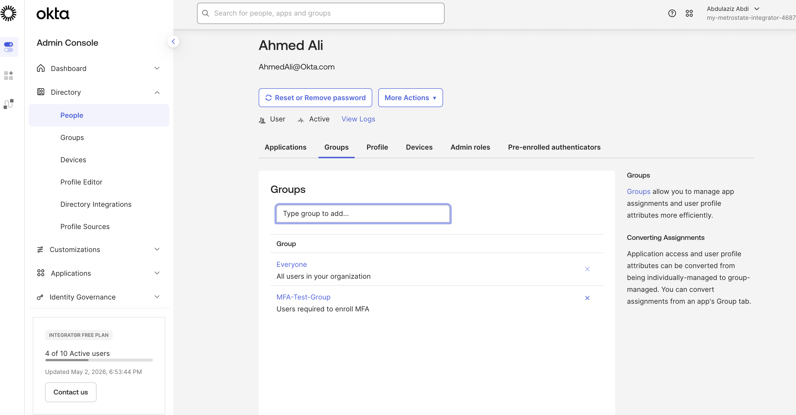
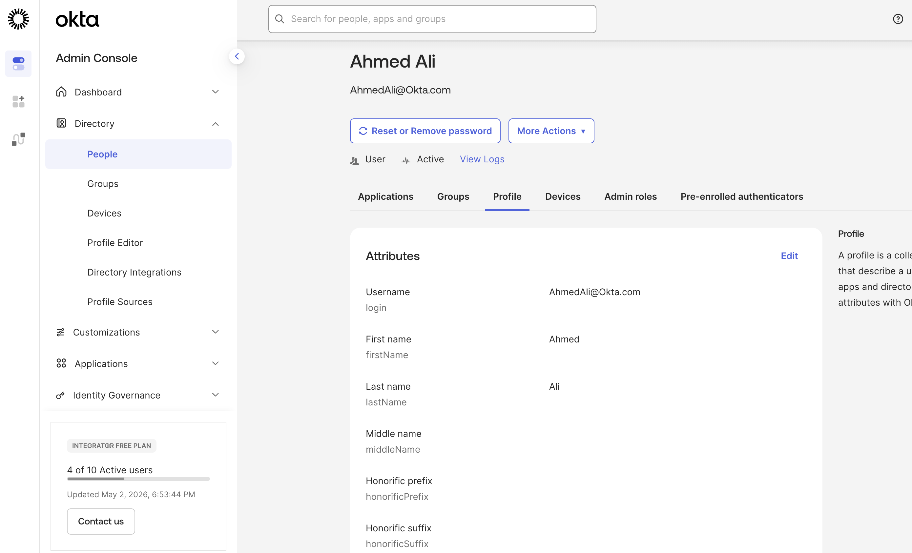
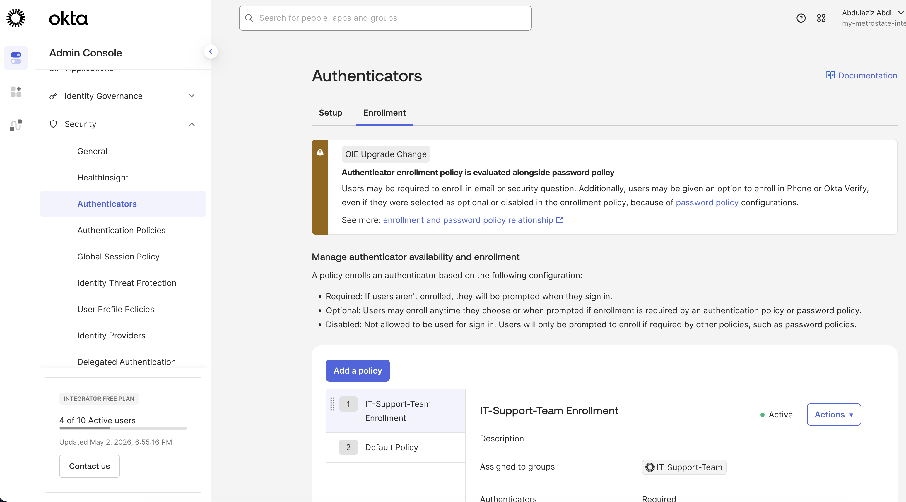
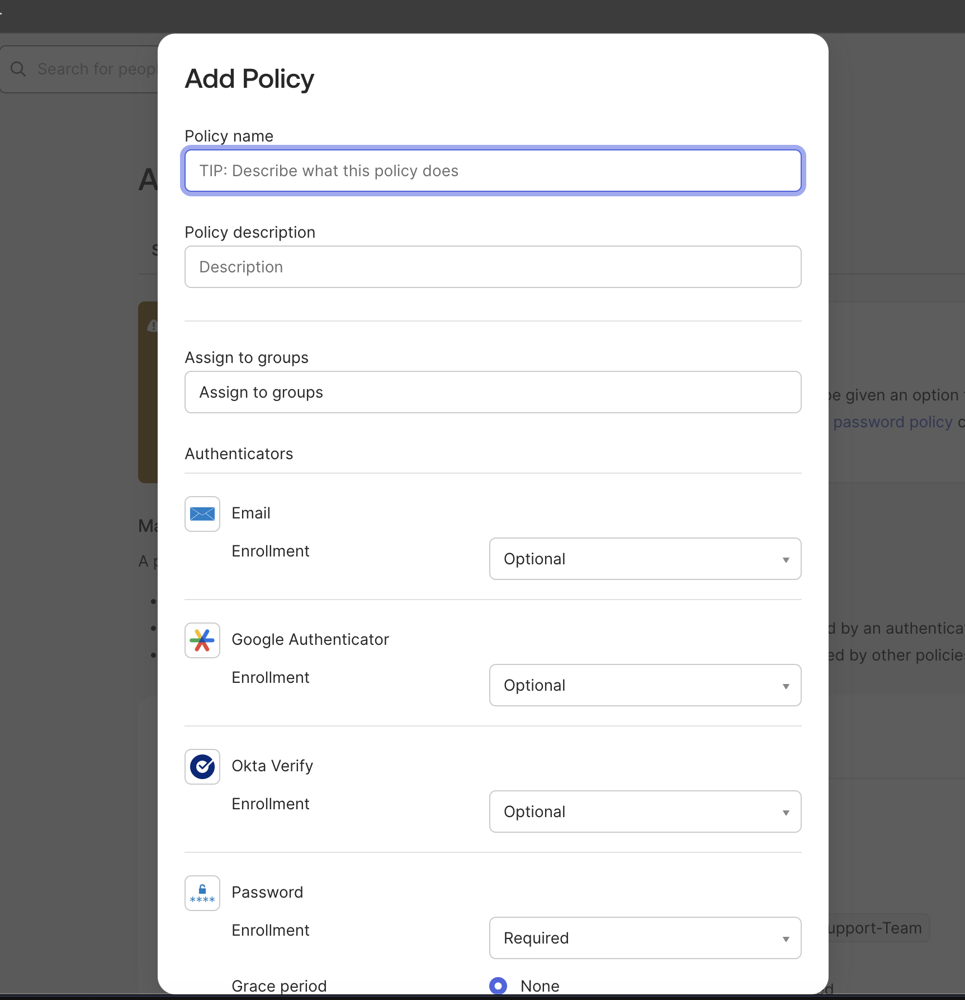
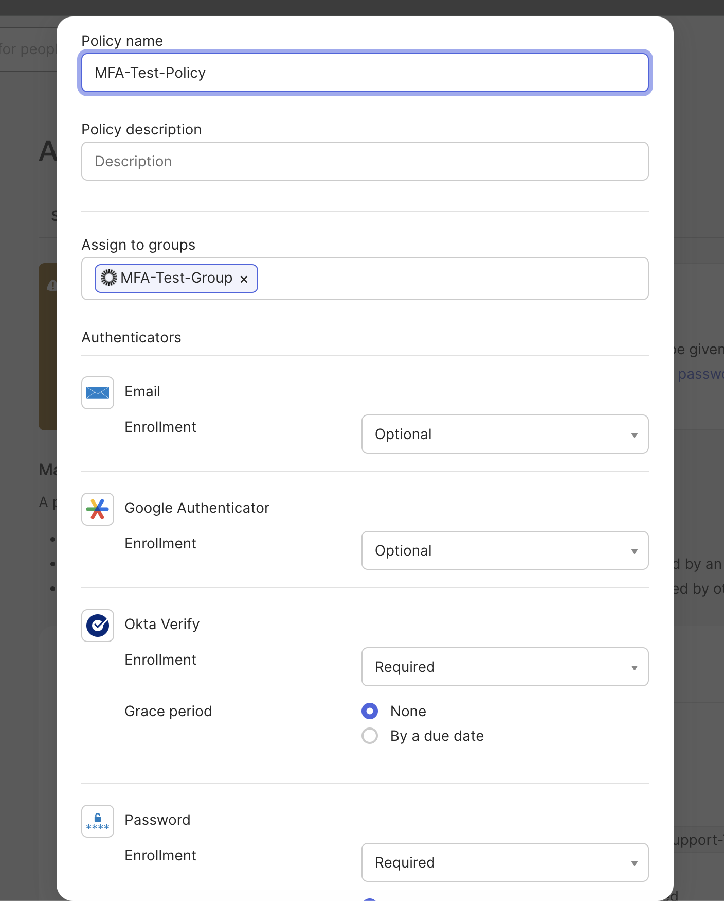
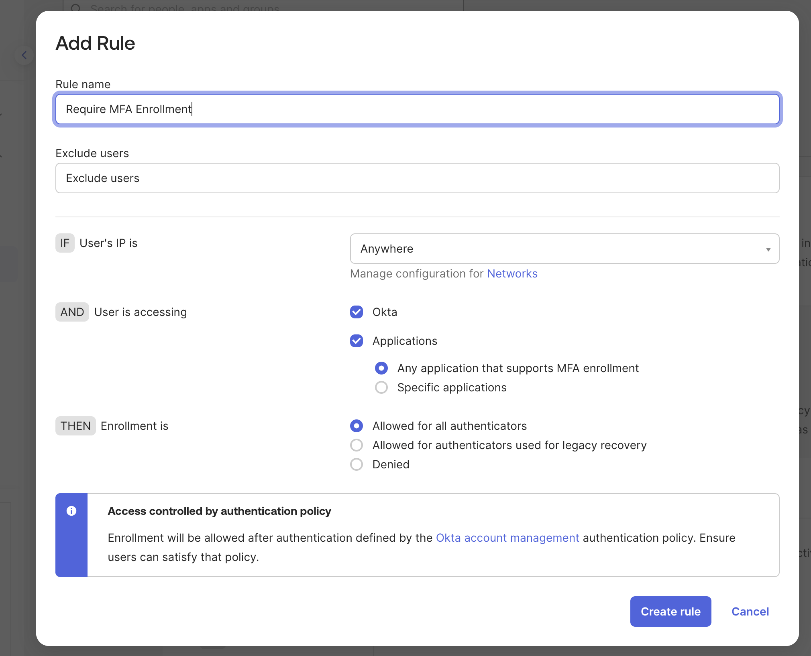
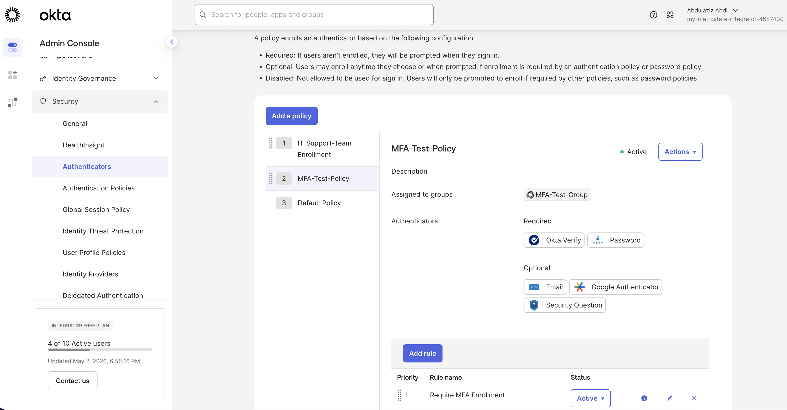
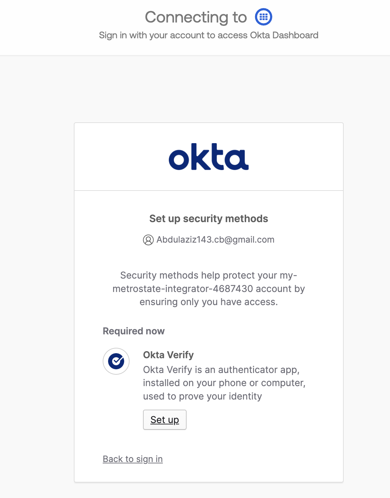

# 🔐 Lab 03 — MFA Enforcement with Okta

## 📌 Objective
Implement Multi-Factor Authentication (MFA) enforcement using Okta by configuring policies, assigning users to groups, and validating enforcement during login.

---

## 🧠 Scenario
An organization requires stronger security controls to protect user accounts. MFA must be enforced for users in a specific group to ensure identity verification beyond passwords.

---

## 🛠️ Steps Performed

### 1. Assign User to MFA Group
User was added to a group that requires MFA enforcement.

---

### 2. Verify User Profile
Confirmed user identity and attributes in Okta.

---

### 3. Navigate to Authenticator Policies
Accessed the Okta Admin Console to manage authentication policies.

---

### 4. Create MFA Policy
Created a new policy to enforce MFA for selected users.

---

### 5. Configure Policy Settings
Configured the policy to require **Okta Verify** as a mandatory authenticator.

---

### 6. Create Enforcement Rule
Defined a rule to enforce MFA enrollment during login.

---

### 7. Activate Policy
Verified the policy is active and properly assigned to the group.

---

### 8. Validate MFA Enforcement
Tested user login and confirmed MFA enrollment is required.

🔥 This screen confirms the policy is successfully enforced.

---

## ✅ Result
- MFA successfully enforced for users in the assigned group  
- Okta Verify required during login  
- Policy and rule configuration validated through real login testing  

---

## 🧩 Key Takeaways
- Group-based policy assignment simplifies access control  
- MFA significantly strengthens identity security  
- Proper testing ensures policies behave as expected  
- Okta policies can enforce authentication at scale  

---

## 🛠️ Tools Used
- Okta Admin Console  
- Okta Verify (Authenticator)  

---

## 🚀 Skills Demonstrated
- Identity & Access Management (IAM)  
- Multi-Factor Authentication (MFA) Implementation  
- Security Policy Configuration  
- User & Group Management  
- Access Control Enforcement  
