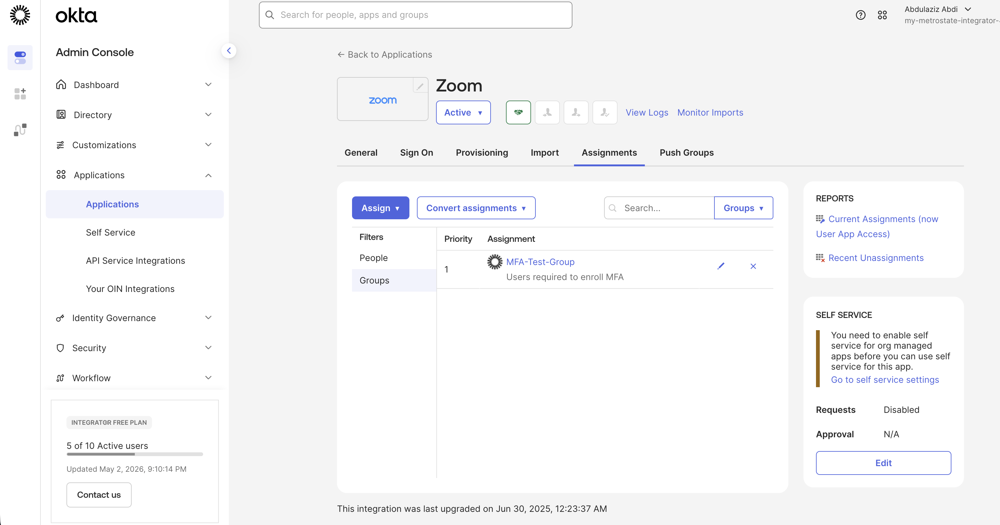
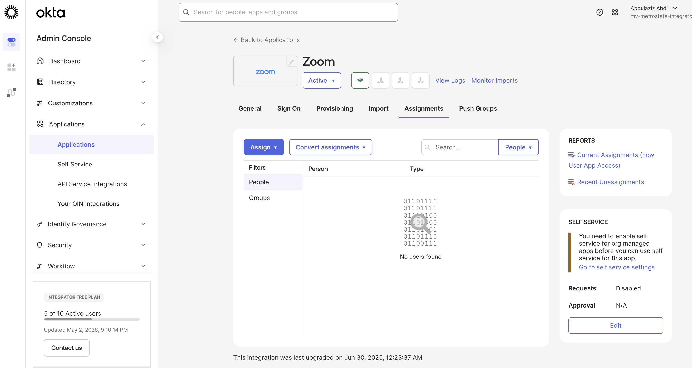
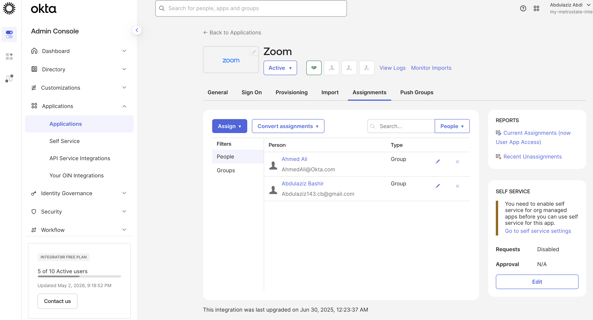
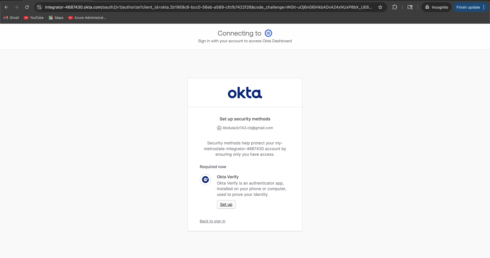

# 🔐 Lab 04 — Single Sign-On (SSO) Application Access

## 📌 Objective

Configure Single Sign-On (SSO) application access in Okta by assigning users and groups to an application and validating inherited access permissions.

---

## 🧠 Scenario

An organization wants employees to securely access company applications through Okta using centralized identity management and group-based access control.

Users assigned to specific groups should automatically receive application access without manual assignment.

---

# 🛠️ Steps Performed

---

## 1️⃣ Assign Group to Application

Assigned the MFA-Test-Group to the Zoom application.

📸 Screenshot:

---

## 2️⃣ Verify No Direct User Assignment

Confirmed there were no manually assigned users before inherited access validation.

📸 Screenshot:

---

## 3️⃣ Verify Inherited User Access

Validated that users automatically inherited Zoom application access through group membership.

Users verified:
- Ahmed Ali
- Abdulaziz Bashir

📸 Screenshot:

---

## 4️⃣ Validate MFA Enforcement

Tested login using assigned user account.

Okta successfully enforced MFA enrollment before granting application access.

📸 Screenshot:

---

# ✅ Result

- Zoom application successfully integrated with Okta
- Group-based application assignment configured
- Users automatically inherited application access
- MFA enforcement triggered successfully during authentication
- Centralized SSO workflow validated

---

# 🧩 Key Takeaways

- Group-based assignments simplify access management
- SSO centralizes authentication workflows
- MFA strengthens enterprise security
- Okta automatically propagates permissions through groups

---

# 🛠️ Tools Used

- Okta Admin Console
- Okta Verify
- Zoom Application
- Okta Integration Network (OIN)

---

# 🚀 Skills Demonstrated

- Single Sign-On (SSO)
- Application Access Management
- Group-Based Access Control (RBAC)
- MFA Enforcement
- IAM Administration
- Enterprise Identity Security
