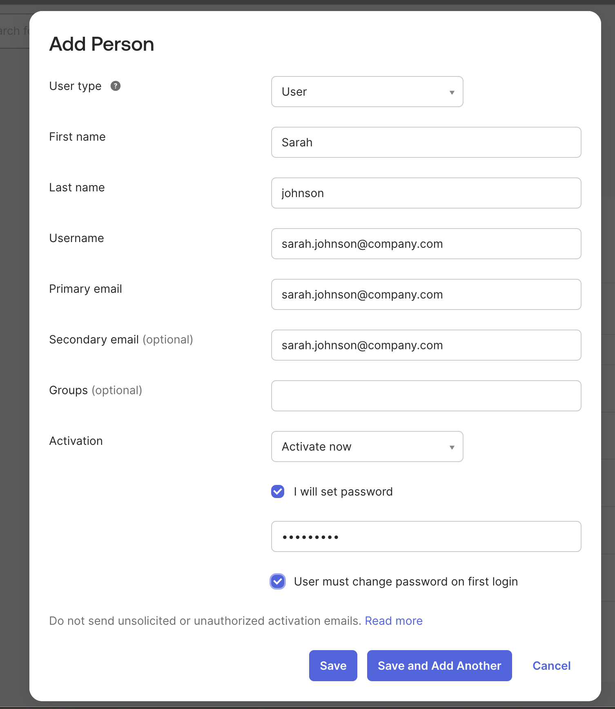
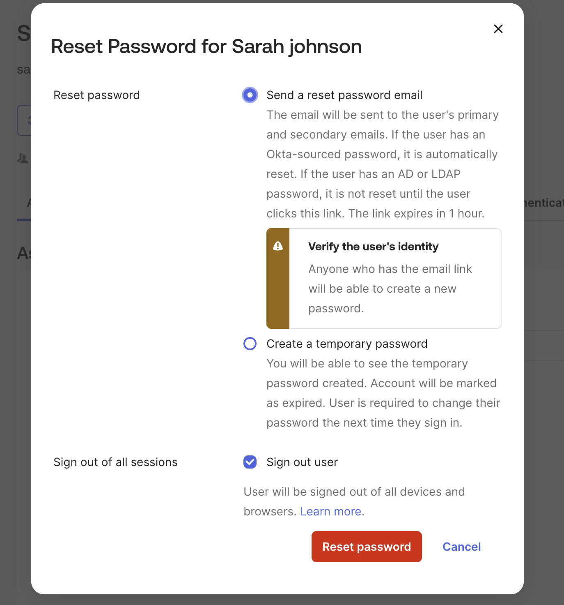
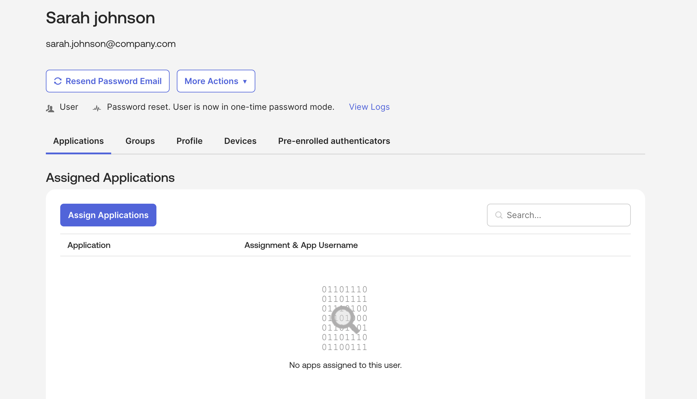
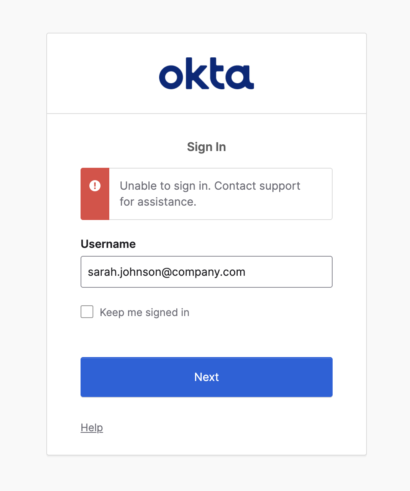
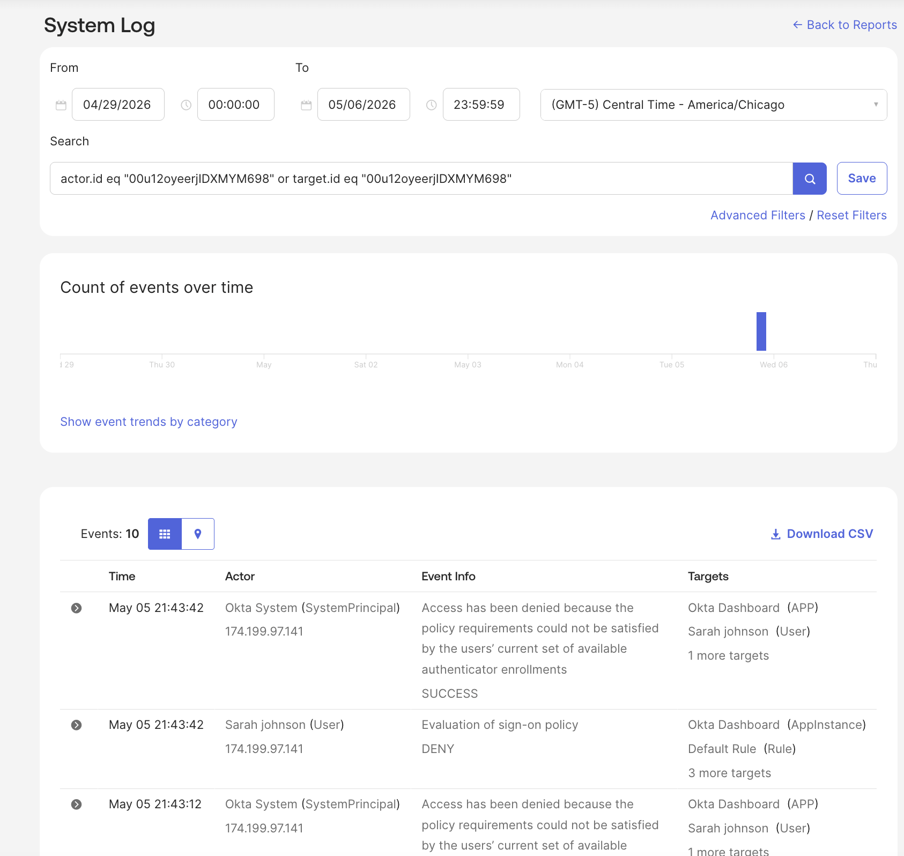

# 🔐 Lab 05 — Password Reset & Account Recovery

## 📌 Objective

Simulate a real-world IAM support workflow by creating a user, resetting the user password, troubleshooting failed login attempts, and reviewing Okta System Logs.

---

## 🧠 Scenario

A user reports they cannot sign in after a password reset. As the IAM administrator, the goal is to verify the account status, reset the password, reproduce the login issue, and review logs to identify the access problem.

---

## 🛠️ Steps Performed

## 1️⃣ Create Test User

Created a new test user named Sarah Johnson in Okta.

---

## 2️⃣ Open Password Reset Workflow

Opened the password reset options for the user account.

---

## 3️⃣ Reset User Password

Sent a password reset email and signed the user out of active sessions.

---

## 4️⃣ Validate Failed Login

Tested the user login and confirmed the user could not sign in.

---

## 5️⃣ Review System Logs

Reviewed Okta System Logs to investigate the failed sign-in and policy denial events.

---

## ✅ Result

- Created a test user in Okta
- Performed password reset workflow
- Confirmed failed login behavior
- Reviewed System Logs for authentication and policy events
- Practiced IAM help desk troubleshooting workflow

---

## 🧩 Key Takeaways

- Password resets are a common IAM support task
- System Logs help identify authentication and policy issues
- Failed login events can be used to troubleshoot access problems
- IAM admins must verify user identity before account recovery actions

---

## 🛠️ Tools Used

- Okta Admin Console
- Okta System Log
- Okta Password Reset Workflow

---

## 🚀 Skills Demonstrated

- Password Reset Support
- Account Recovery
- IAM Troubleshooting
- Authentication Log Review
- User Access Support
- Help Desk / IAM Operations
