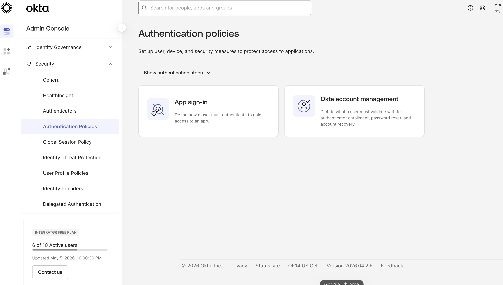
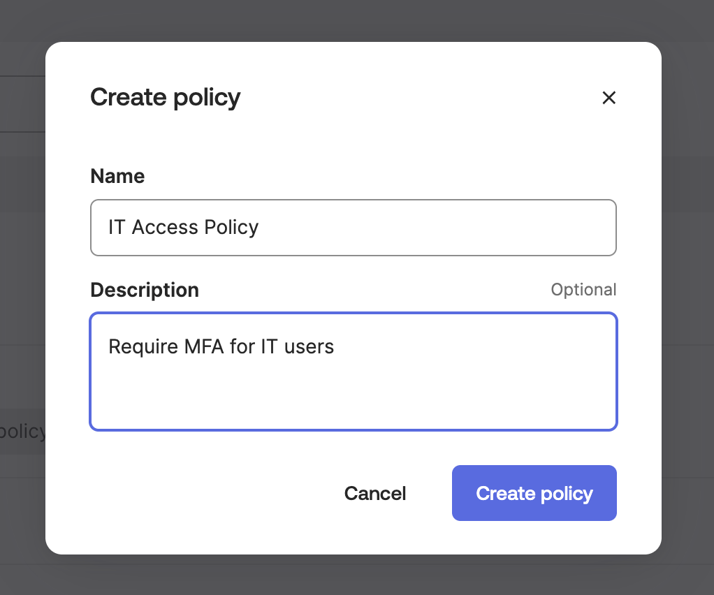
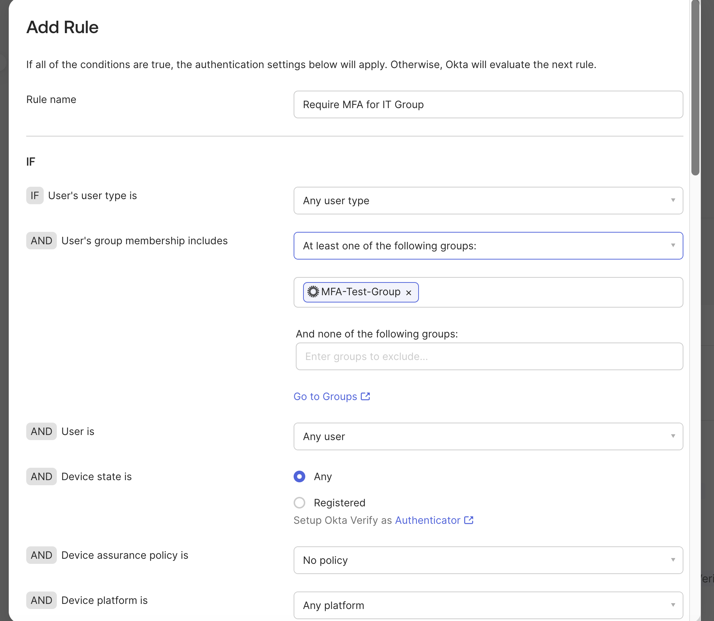
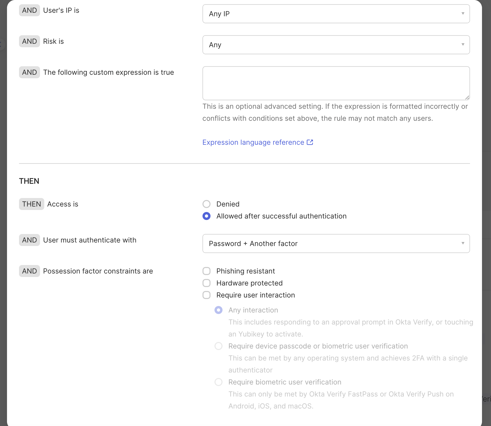
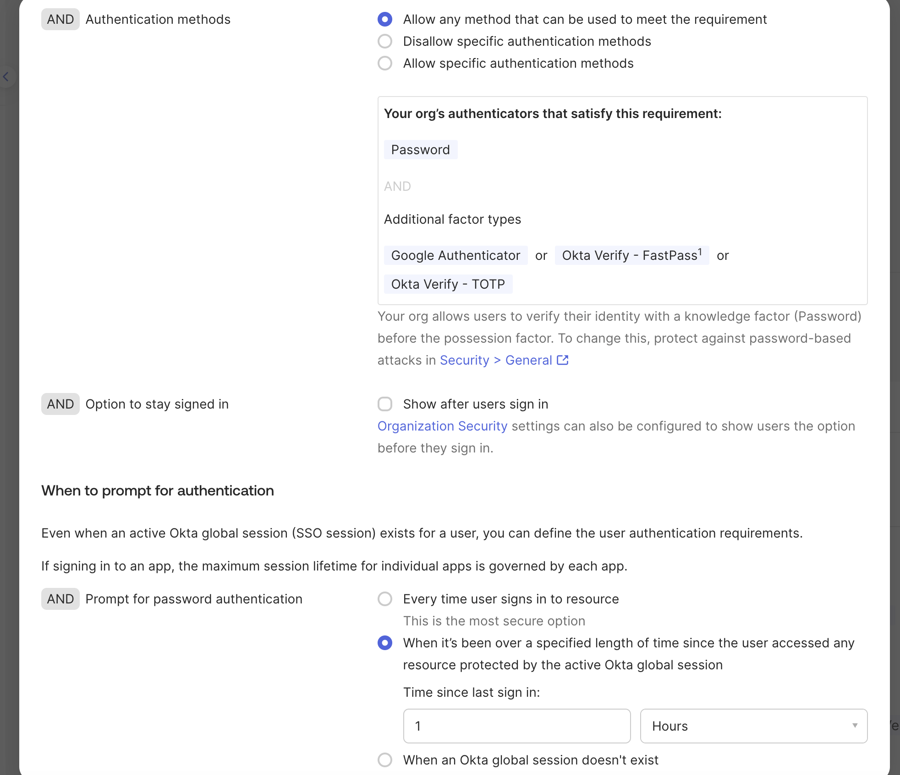
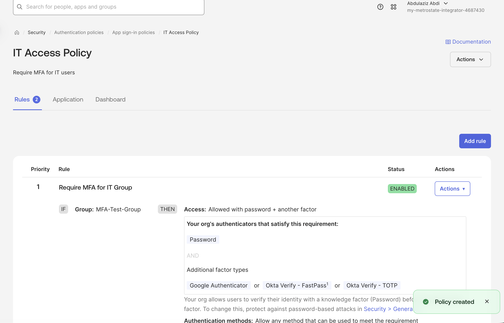
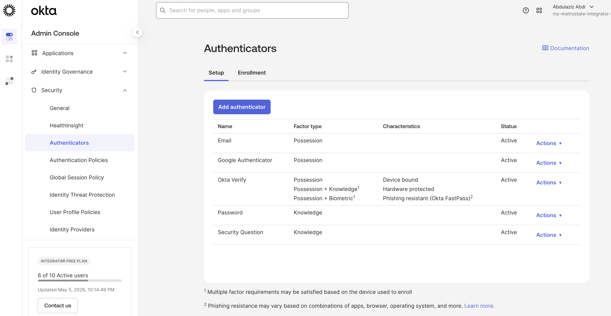

# 🔐 Lab 6 — Authentication Policies & MFA Enforcement

## 🎯 Objective

Configure authentication policies in Okta to enforce Multi-Factor Authentication (MFA) for a specific user group.

This lab demonstrates how IAM administrators implement authentication security controls to protect enterprise applications and user accounts.

---

# 🛠 Technologies Used

- Okta Admin Console
- Okta Authentication Policies
- Multi-Factor Authentication (MFA)
- Group-Based Access Control (RBAC)
- Okta Verify
- Google Authenticator

---

# 📘 Lab Overview

In this lab, I created an authentication policy that requires users within a specific group to authenticate using a password and an additional authentication factor.

The policy was configured to:
- Apply only to a designated MFA test group
- Require password + secondary authentication factor
- Support multiple authenticators
- Enforce secure authentication workflows
- Simulate enterprise IAM access control policies

---

# 📂 Authentication Policy Configuration

## Step 1 — Navigate to Authentication Policies

From the Okta Admin Console:

Security → Authentication Policies

This section is used to manage authentication rules and enforce access security across users and applications.

### Screenshot

---

# 🔹 Step 2 — Create Authentication Policy

Created a new authentication policy named:

`IT Access Policy`

Description:
`Require MFA for IT users`

### Screenshot

---

# 🔹 Step 3 — Configure Policy Rule

Created a rule named:

`Require MFA for IT Group`

The rule was configured to apply to:

- MFA-Test-Group
- Any user type
- Any device platform
- Any IP address

### Screenshot

---

# 🔹 Step 4 — Configure MFA Requirements

Configured the policy to require:

- Password + Another Factor

Allowed authenticators included:
- Google Authenticator
- Okta Verify FastPass
- Okta Verify TOTP

This configuration simulates enterprise MFA enforcement policies commonly used to secure privileged access.

### Screenshot

---

# 🔹 Step 5 — Configure Authentication Prompt Timing

Configured authentication prompts to require reauthentication after a specified session duration.

This helps reduce unauthorized access risks while maintaining session security.

### Screenshot

---

# 🔹 Step 6 — Validate Active Policy

Verified the authentication policy and rule were successfully enabled within Okta.

The policy now enforces MFA requirements for users assigned to the MFA-Test-Group.

### Screenshot

---

# 🔹 Step 7 — Review Enabled Authenticators

Verified enabled authenticators available within the Okta environment.

Configured authenticators included:
- Email
- Google Authenticator
- Okta Verify
- Password
- Security Question

### Screenshot

---

# ✅ Skills Demonstrated

- Authentication Policy Configuration
- Multi-Factor Authentication (MFA)
- Okta Security Administration
- Identity Access Control
- Group-Based Policy Enforcement
- IAM Security Operations
- Enterprise Authentication Management
- Access Security Validation
- Okta Authenticator Management
- Conditional Authentication Controls

---

# 🔐 Real-World IAM Concepts Practiced

This lab simulates real enterprise IAM administration tasks including:

- Securing privileged user access
- Enforcing MFA policies
- Managing authentication methods
- Applying conditional access controls
- Protecting enterprise applications
- Implementing layered authentication security

These are common responsibilities for:
- IAM Analysts
- Identity Engineers
- Cloud IAM Administrators
- IT Support & Security Teams

---

# 📌 Key Takeaway

Authentication policies and MFA enforcement are critical components of enterprise identity security.

This lab demonstrates practical experience configuring authentication controls that help organizations reduce unauthorized access risks and strengthen account security.
