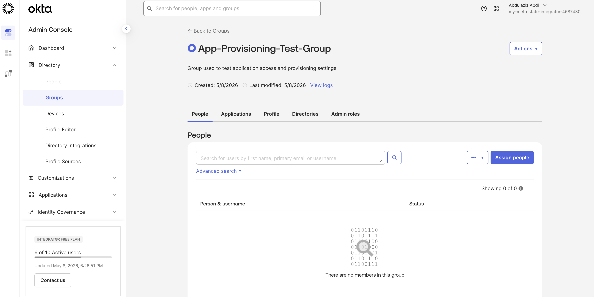
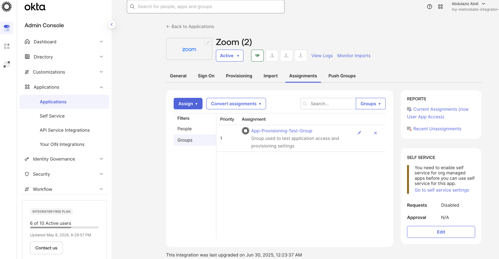
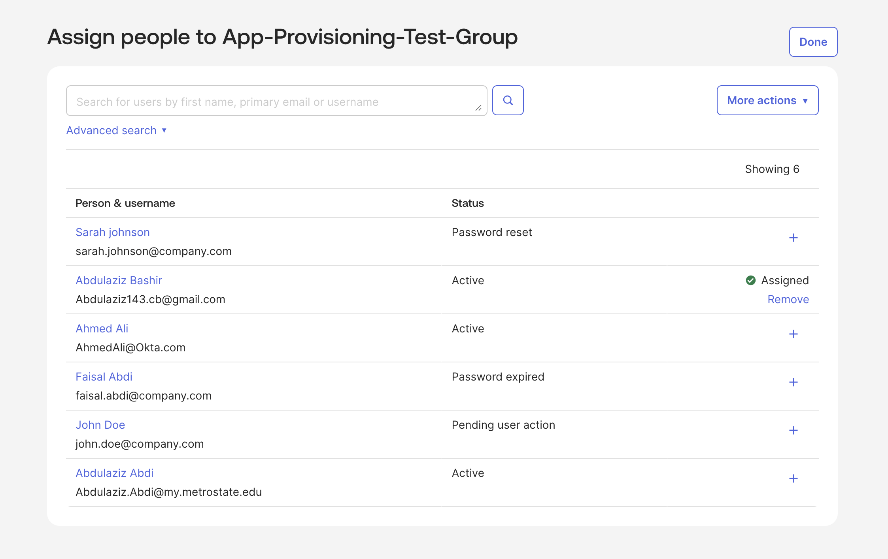
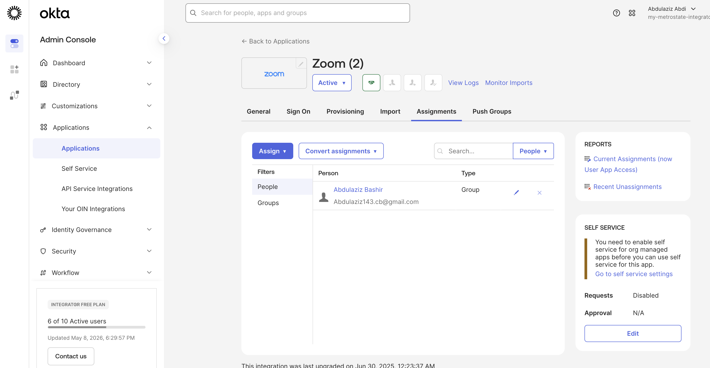
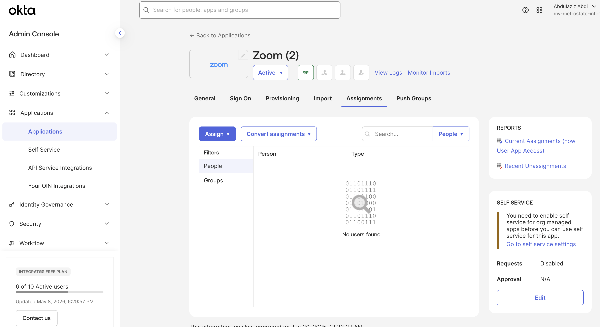
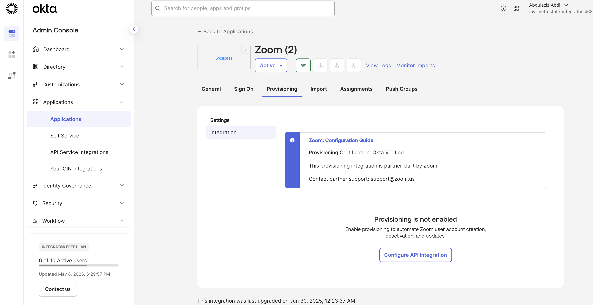
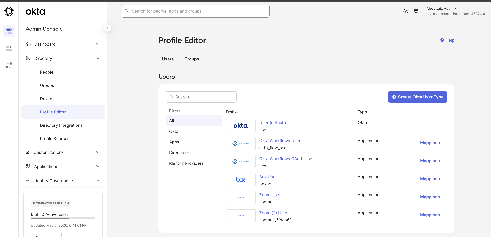
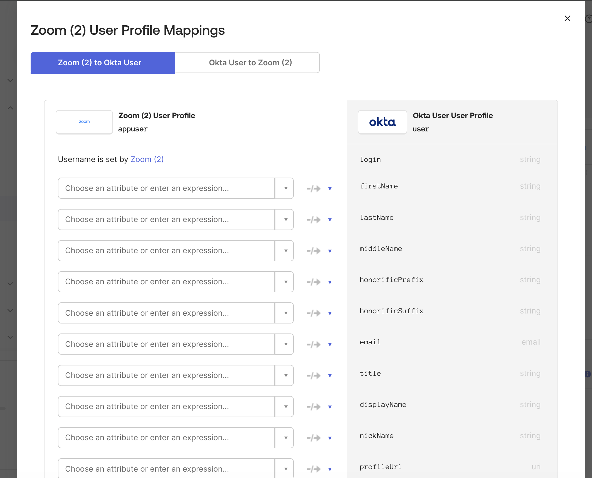

# 🔐 Lab 07 — Application Provisioning & Attribute Mapping

## 📘 Objective

This lab demonstrates how Okta manages application provisioning, group-based application assignments, and user attribute mappings for enterprise SaaS applications.

The lab focuses on understanding how Okta acts as the identity source of truth by controlling application access, user synchronization, and lifecycle management workflows.

---

# 🛠 Technologies Used

- Okta Admin Console  
- Okta Profile Editor  
- Zoom Application Integration  
- Group-Based Access Control (RBAC)  
- Application Provisioning Concepts  
- Attribute Mapping Workflows  

---

# 📂 Lab Overview

In this lab, the following tasks were completed:

- Created a provisioning test group  
- Assigned the group to an enterprise application  
- Added users to the assigned group  
- Validated inherited application access  
- Reviewed provisioning integration settings  
- Explored provisioning lifecycle workflows  
- Opened Profile Editor mappings  
- Reviewed attribute synchronization directions  
- Analyzed source-of-truth identity mapping concepts  

---

# 🔹 Step 1 — Create Provisioning Test Group

A dedicated group was created to simulate enterprise application provisioning and access workflows.

## Tasks Performed
- Created a new security group  
- Configured group description  
- Prepared group for application assignments  

## Screenshot



---

# 🔹 Step 2 — Assign Group to Application

The provisioning test group was assigned to the Zoom application to simulate centralized access management.

## Tasks Performed
- Opened Zoom application assignments  
- Assigned provisioning group to application  
- Validated successful group assignment  

## Screenshot



---

# 🔹 Step 3 — Add Users to Group

Users were added to the provisioning group to inherit application access automatically.

## Tasks Performed
- Opened group membership management  
- Added test users to provisioning group  
- Simulated enterprise onboarding workflow  

## Screenshot



---

# 🔹 Step 4 — Validate Inherited Application Access

The user inherited Zoom application access through group membership.

## Tasks Performed
- Reviewed inherited assignments  
- Confirmed automatic application access  
- Validated RBAC-based application assignment  

## Screenshot



---

# 🔹 Step 5 — Add Enterprise Application

The Zoom enterprise application integration was added and configured inside Okta.

## Tasks Performed
- Added Zoom application integration  
- Opened application management settings  
- Prepared application for provisioning review  

## Screenshot



---

# 🔹 Step 6 — Review Provisioning Configuration

Provisioning settings were reviewed to understand automated lifecycle management workflows.

## Tasks Performed
- Opened provisioning settings  
- Reviewed API integration workflow  
- Examined provisioning capabilities  
- Analyzed automated lifecycle concepts  

## Screenshot


---

# 🔹 Step 7 — Review Provisioning Features

Provisioning concepts related to enterprise SaaS lifecycle management were analyzed.

## Topics Reviewed
- Automated account provisioning  
- User synchronization  
- Account deactivation workflows  
- API-based provisioning integration  
- SaaS identity lifecycle management  

## Screenshot



---

# 🔹 Step 8 — Open Profile Editor

The Okta Profile Editor was used to review user and application profiles.

## Tasks Performed
- Opened Profile Editor  
- Reviewed Okta user profiles  
- Reviewed application profile mappings  
- Located Zoom application profile  

## Screenshot



---

# 🔹 Step 9 — Review Attribute Mappings

Attribute mappings between Okta and Zoom were reviewed.

## Tasks Performed
- Opened Zoom attribute mappings  
- Reviewed synchronization attributes  
- Examined user profile fields  

## Attributes Reviewed
- Username  
- First Name  
- Last Name  
- Email  
- Display Name  
- Profile Attributes  

## Screenshot



---

# 🔹 Step 10 — Review Mapping Direction

Identity synchronization direction was reviewed to understand source-of-truth management.

## Tasks Performed
- Reviewed mapping direction  
- Analyzed identity synchronization flow  
- Reviewed Okta-to-application provisioning logic  

## Key IAM Concept

```text
Okta User → Zoom (2)
