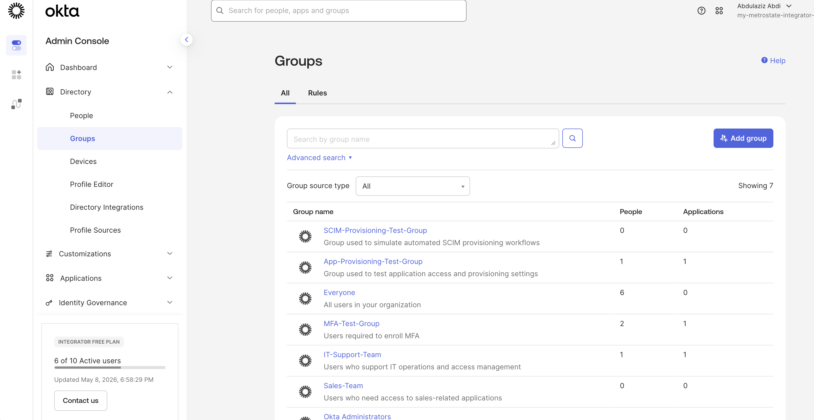
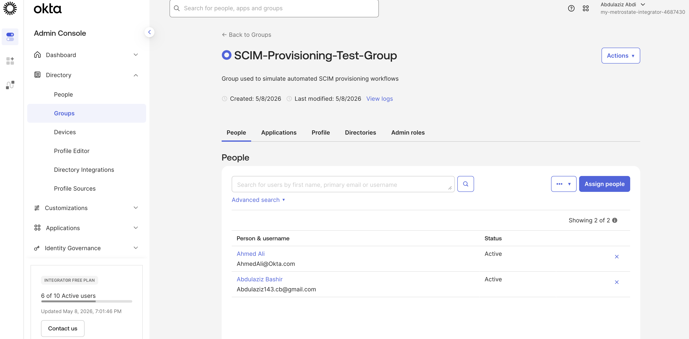
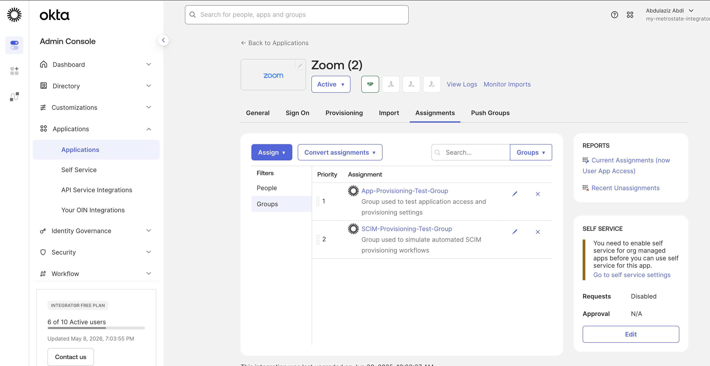
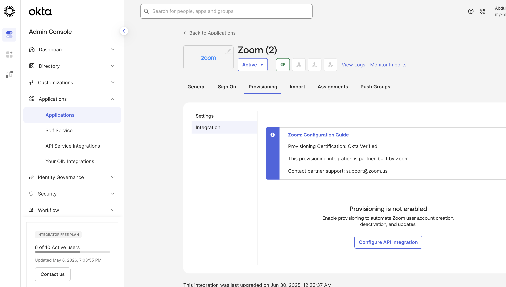
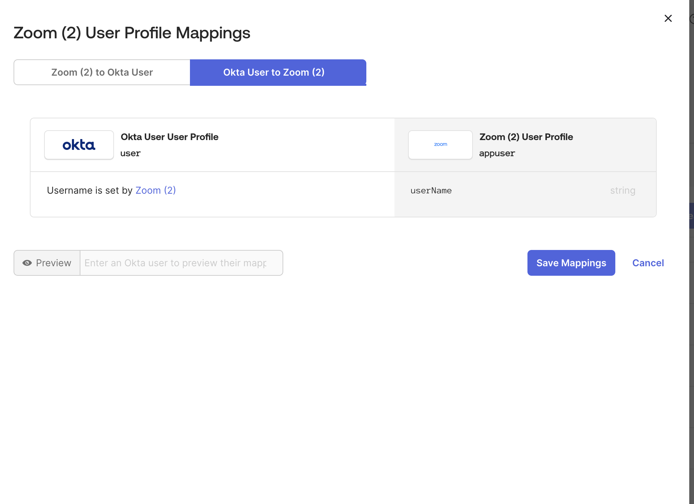
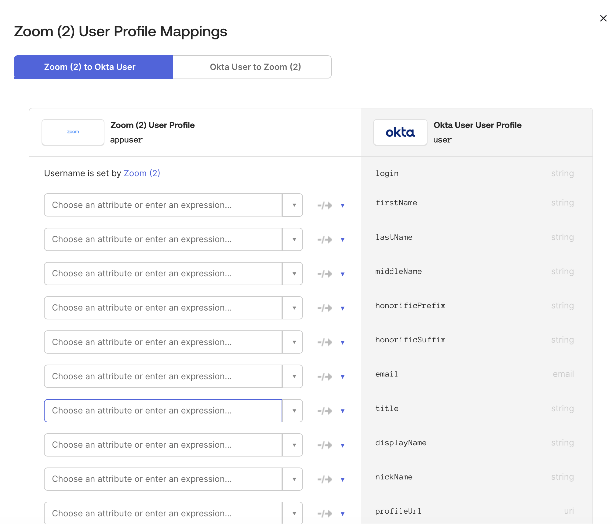
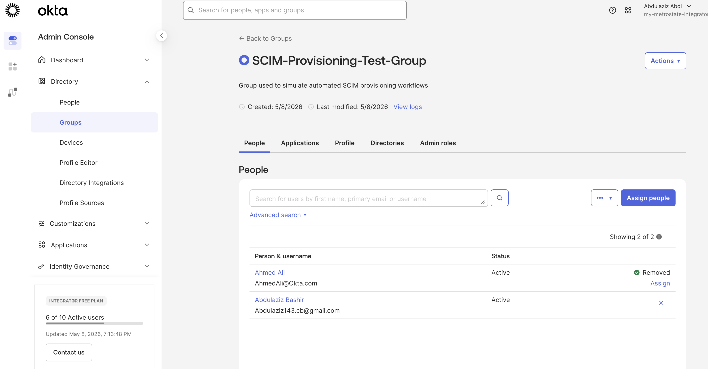
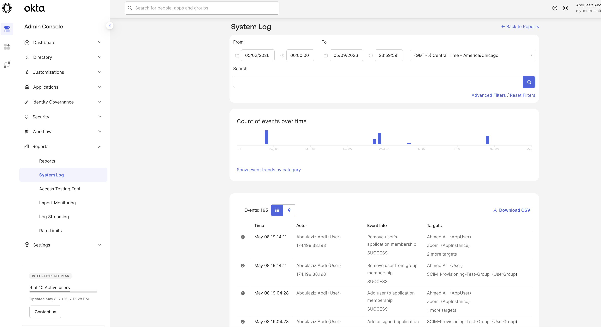

# 🔐 Lab 8 — SCIM Provisioning & Lifecycle Automation

## 🎯 Objective

This lab demonstrates how SCIM-style provisioning workflows can be simulated using Okta group assignments, application integrations, profile mappings, and lifecycle management processes.

The goal of this lab is to understand how enterprise IAM teams automate:
- user provisioning
- access assignments
- lifecycle automation
- identity synchronization
- deprovisioning workflows
- SaaS access management

---

# 🛠 Technologies Used

- Okta Admin Console
- Okta Groups
- Okta Application Assignments
- SCIM Provisioning Concepts
- Profile Mappings
- System Log Monitoring
- Identity Lifecycle Management

---

# 📘 Scenario

An organization wants to automate user access provisioning for cloud applications using group-based assignments and identity lifecycle workflows.

The IAM administrator must:
- create provisioning groups
- assign users
- connect applications
- validate profile mappings
- simulate provisioning events
- review audit logs

---

# 🔹 Part 1 — Create Provisioning Group

Created a group used to simulate automated SCIM provisioning workflows.

### Group Created
- SCIM-Provisioning-Test-Group

### Skills Demonstrated
- Group administration
- Identity organization
- Access management structure

### Screenshot

---

# 🔹 Part 2 — Assign Users to Group

Added test users into the provisioning group to simulate automated lifecycle assignments.

### Users Added
- Abdulaziz Bashir
- Ahmed Ali

### Skills Demonstrated
- Group membership management
- User assignment workflows
- Lifecycle administration

### Screenshot

---

# 🔹 Part 3 — Assign Application to Group

Assigned the Zoom application to the SCIM provisioning group.

This simulates enterprise SaaS application provisioning through group-based access management.

### Application Assigned
- Zoom

### Skills Demonstrated
- Application assignment
- SaaS access management
- Group-based provisioning

### Screenshot

---

# 🔹 Part 4 — Review Provisioning Settings

Reviewed provisioning configuration settings within the Zoom application integration.

This demonstrates understanding of SCIM provisioning architecture and lifecycle automation workflows.

### Skills Demonstrated
- Provisioning review
- Application lifecycle management
- IAM provisioning concepts

### Screenshot

---

# 🔹 Part 5 — Review Profile Mappings

Reviewed Okta-to-application and application-to-Okta profile mappings.

This demonstrates how identity attributes are synchronized between identity providers and connected SaaS applications.

### Skills Demonstrated
- Identity attribute mapping
- Profile synchronization
- Identity governance

### Screenshots

#### Okta → Zoom Mapping

#### Zoom → Okta Mapping

---

# 🔹 Part 6 — Simulate User Deprovisioning

Removed a user from the provisioning group to simulate lifecycle deprovisioning.

This demonstrates how enterprise IAM teams revoke access during:
- offboarding
- access reviews
- role changes
- security incidents

### User Removed
- Ahmed Ali

### Skills Demonstrated
- Access revocation
- Lifecycle management
- Deprovisioning workflows

### Screenshot

---

# 🔹 Part 7 — Review System Logs

Reviewed Okta System Logs to validate provisioning and lifecycle activity.

Verified events such as:
- user assignment
- group membership updates
- application assignments
- access removal actions

### Skills Demonstrated
- Identity auditing
- IAM monitoring
- Security event review
- Lifecycle tracking
- Audit log analysis

### Screenshot

---

# ✅ Lab Summary

In this lab, the following IAM workflows were demonstrated:

- Group-based provisioning
- SaaS application assignments
- Identity lifecycle management
- User provisioning concepts
- Deprovisioning workflows
- Profile mapping reviews
- Access revocation
- Identity synchronization
- Audit logging
- SCIM provisioning concepts

---

# 🛠 Skills Demonstrated

- SCIM Provisioning Concepts
- Identity Lifecycle Management
- SaaS Access Administration
- Access Provisioning
- Access Deprovisioning
- Group-Based Access Control
- Application Lifecycle Administration
- Identity Synchronization
- Okta Administration
- Identity Governance
- Security Auditing
- IAM Monitoring
- Enterprise Identity Operations

---

# 📌 Notes

This lab simulates enterprise SCIM provisioning workflows using Okta application integrations and group-based lifecycle management.

The workflows demonstrated in this lab are commonly used by:
- IAM Analysts
- Identity Engineers
- Security Operations Teams
- IT Administrators
- Cloud Identity Teams

These concepts are heavily used in modern enterprise identity environments involving:
- Okta
- Microsoft Entra ID
- Google Workspace
- SaaS identity integrations
- Cloud access governance
