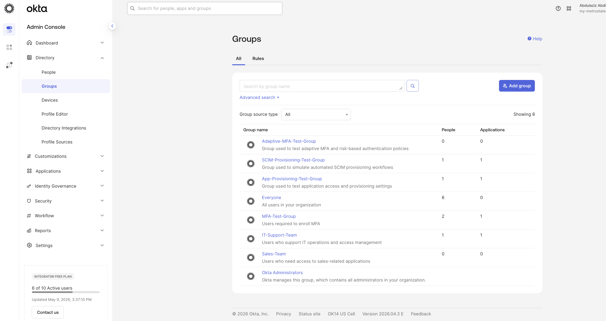
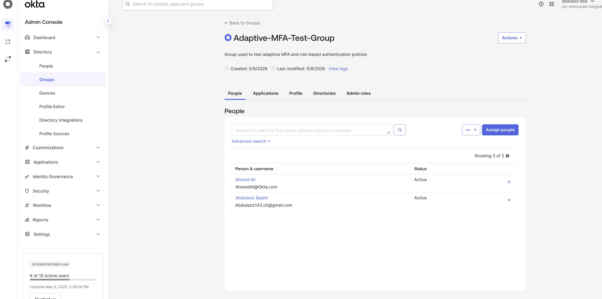
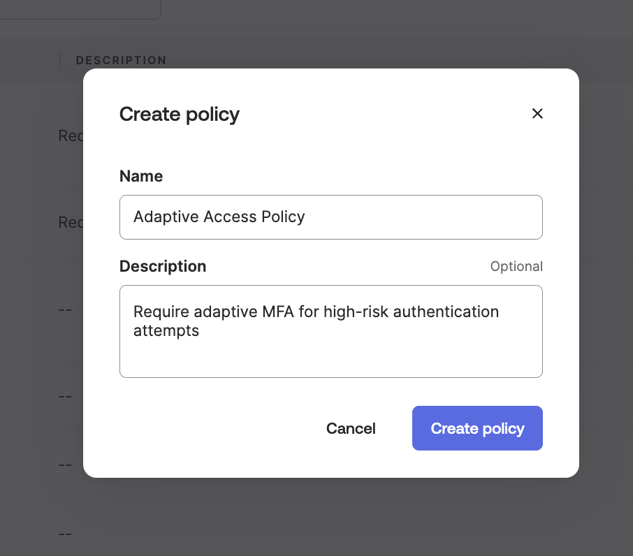
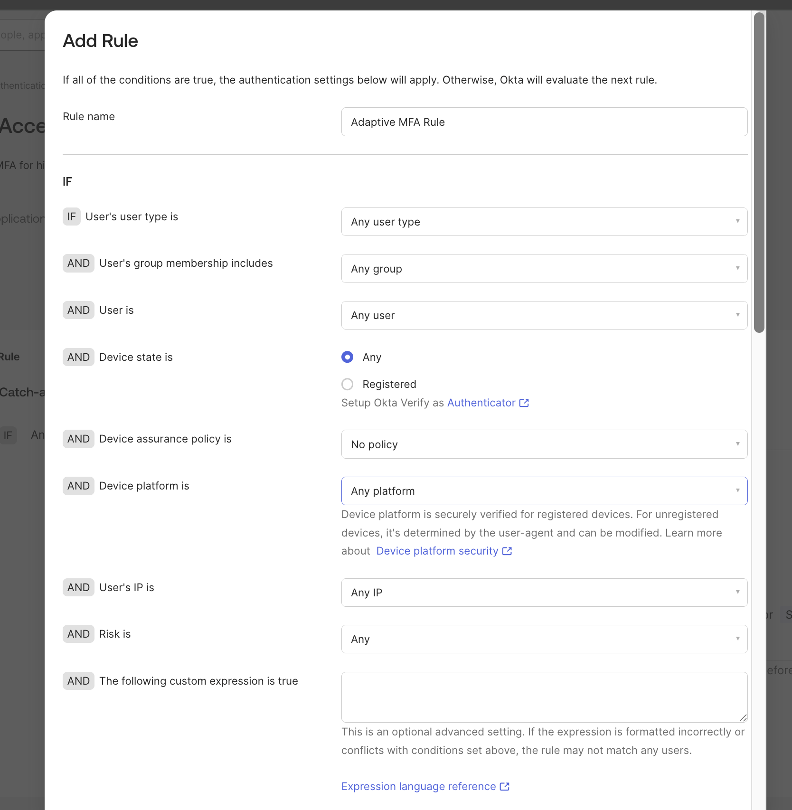
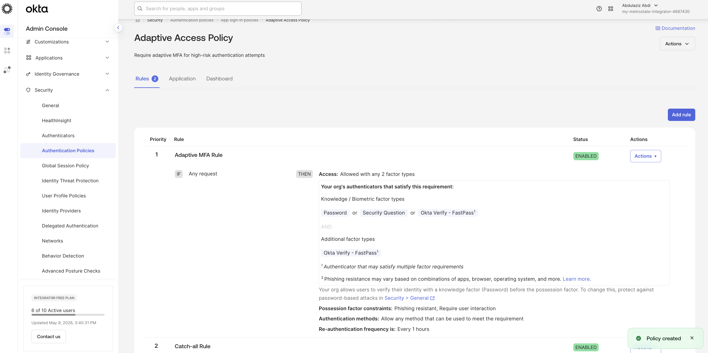
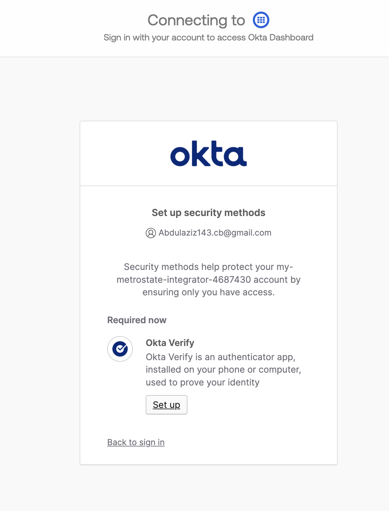
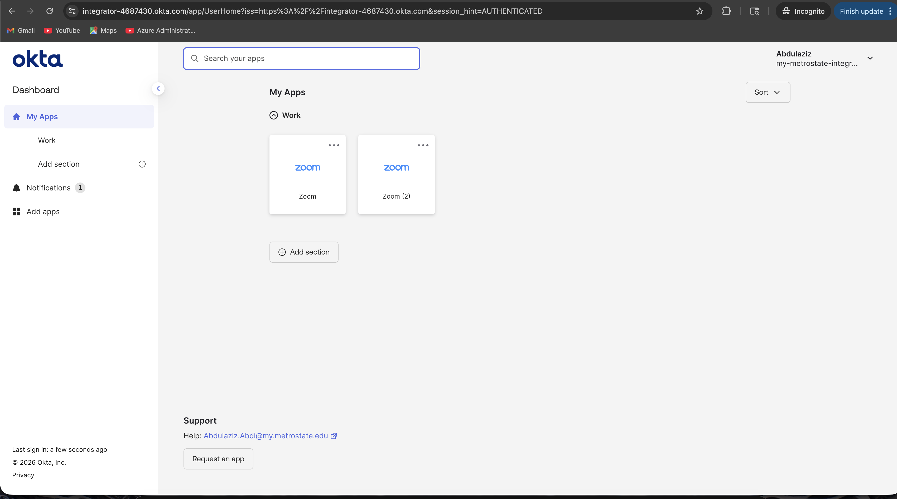
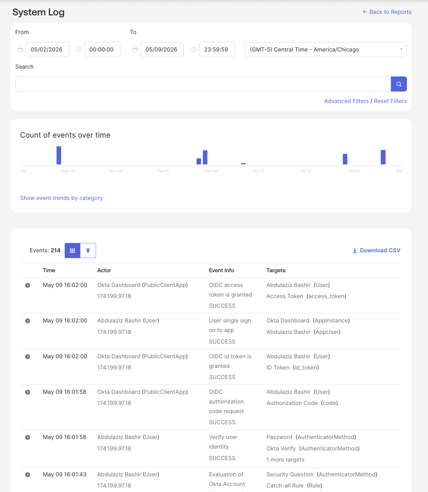

# 🔐 Lab 9 — Adaptive MFA & Risk-Based Authentication

## 📌 Overview

This lab demonstrates how adaptive authentication and Multi-Factor Authentication (MFA) policies can be used to strengthen enterprise identity security within Okta.

The lab focuses on creating adaptive authentication policies, enforcing MFA requirements, validating secure sign-in workflows, configuring Okta Verify, and reviewing authentication activity through Okta System Logs.

This simulates real-world IAM and identity security operations commonly performed by Identity Administrators, IAM Analysts, and Security Engineers.

---

# 🎯 Objectives

- Create an Adaptive MFA security group
- Assign users to adaptive authentication policies
- Configure adaptive authentication policies
- Create MFA enforcement rules
- Configure risk-aware authentication settings
- Enforce Okta Verify MFA requirements
- Validate secure authentication workflows
- Review authentication activity in System Logs
- Simulate enterprise identity protection workflows

---

# 🛠 Technologies Used

- Okta Admin Console
- Okta Verify
- Authentication Policies
- Adaptive MFA Policies
- Okta System Logs
- Identity Security Controls
- Risk-Based Authentication Concepts

---

# 👥 Part 1 — Create Adaptive MFA Test Group

Created a dedicated security group to simulate adaptive authentication policy assignments for enterprise users.

### Actions Performed
- Navigated to Directory → Groups
- Created Adaptive-MFA-Test-Group
- Added description for security testing
- Saved group configuration

---

## 📸 Screenshot

---

# 👥 Part 2 — Assign Users to Group

Assigned test users to the Adaptive MFA security group to simulate enterprise MFA policy targeting.

### Actions Performed
- Opened Adaptive-MFA-Test-Group
- Added multiple test users
- Verified active membership assignments
- Confirmed group-based targeting configuration

---

## 📸 Screenshot

---

# 🔐 Part 3 — Create Adaptive Access Policy

Created a dedicated Adaptive Access Policy to enforce MFA requirements during authentication attempts.

### Actions Performed
- Navigated to Security → Authentication Policies
- Selected App Sign-In Policies
- Created Adaptive Access Policy
- Added policy description
- Enabled policy configuration

---

## 📸 Screenshot

---

# 🛡 Part 4 — Configure Adaptive MFA Rule

Configured an adaptive MFA rule requiring additional authentication verification.

### Actions Performed
- Added Adaptive MFA Rule
- Configured policy conditions
- Enabled MFA enforcement
- Required Okta Verify authentication
- Applied secure authentication controls
- Configured re-authentication timing

---

## 📸 Screenshot

---

# ✅ Part 5 — Validate Policy Creation

Validated successful creation and activation of the adaptive authentication policy.

### Actions Performed
- Reviewed policy configuration
- Verified enabled status
- Confirmed MFA enforcement settings
- Validated authentication requirements

---

## 📸 Screenshot

---

# 📲 Part 6 — MFA Enrollment Prompt

Simulated a user sign-in experience requiring Okta Verify enrollment.

### Actions Performed
- Accessed Okta user dashboard
- Triggered MFA enrollment prompt
- Reviewed Okta Verify setup requirements
- Validated adaptive authentication enforcement

---

## 📸 Screenshot

---

# 🔓 Part 7 — Successful MFA Authentication

Successfully authenticated using Okta Verify MFA security controls.

### Actions Performed
- Completed Okta Verify setup
- Approved MFA authentication request
- Successfully accessed Okta Dashboard
- Validated secure sign-in workflow

---

## 📸 Screenshot

---

# 📊 Part 8 — Review Authentication Logs

Reviewed Okta System Logs to validate authentication events and MFA activity.

### Actions Performed
- Navigated to Reports → System Log
- Reviewed authentication events
- Validated MFA verification activity
- Monitored login success events
- Analyzed authentication workflow logs

---

## 📸 Screenshot

---

# 🔍 Skills Demonstrated

- Adaptive MFA Administration
- Authentication Policy Configuration
- Risk-Based Authentication Concepts
- Identity Security Operations
- MFA Enforcement
- Okta Verify Administration
- Secure Authentication Workflows
- Identity Threat Protection Concepts
- Group-Based Security Policy Assignment
- Authentication Troubleshooting
- Okta System Log Analysis
- Enterprise IAM Operations
- Access Security Enforcement
- Identity Protection Operations

---

# 🔐 IAM Concepts Covered

This lab includes hands-on practice with:

- Adaptive Authentication
- MFA Enrollment
- Risk-Based Authentication
- Authentication Policies
- Secure Sign-In Enforcement
- Identity Protection
- Access Security Controls
- Authentication Event Monitoring
- Identity Threat Detection Concepts
- Enterprise Authentication Security
- User Verification Workflows

---

# 📌 Key Takeaways

This lab demonstrates how organizations use adaptive authentication and MFA enforcement to secure enterprise identities and reduce unauthorized access risks.

The lab also highlights how Okta administrators can monitor authentication activity, enforce stronger verification requirements, and implement identity security best practices using centralized IAM controls.

---

# ✅ Lab Status

✔ Completed Successfully
